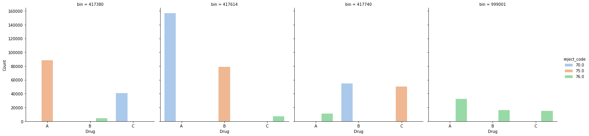
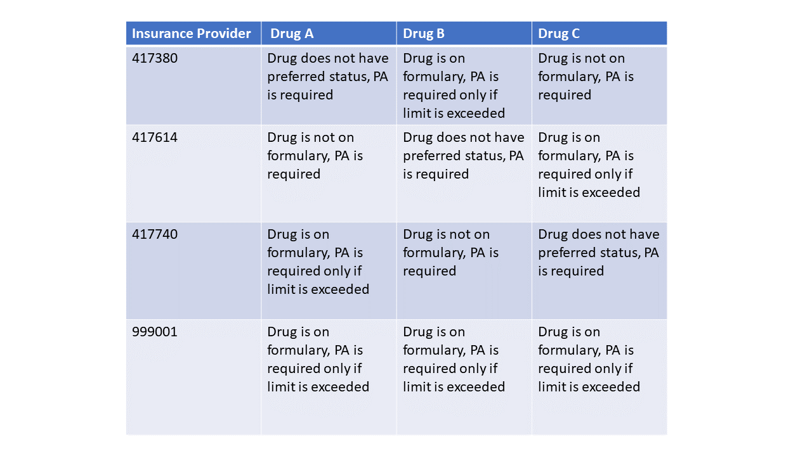
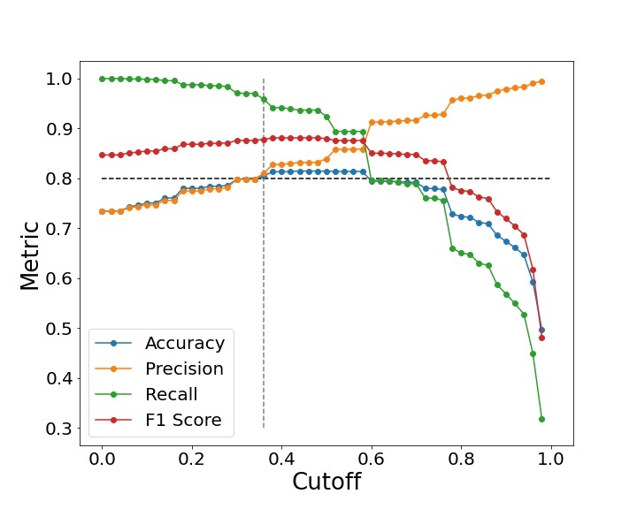

# Predicting Prior Authorization(PA) requirement and approval probability
Luke Corwin, Yiming Gong, Prerna Kabtiyal, Katherine Zhang

All authors have equal contribution to this project.
## Overview
Prior authorization(PA) is a process required to determine whether a medical service or prescription will be covered by the health insurance provider of a patient.A PA is submitted by the Health Care Provider directly to the Health Insurance Provider and the PA has to be approved before the patient can receive the required service and prescription. This process traditionally takes place through multiple fax-based correspondences between the Healthcare Provider and Insurance Provider. Different Health Insurance Providers have different PA requirements and parameters of assessment for different drugs/services, adding to the vagueness of this process. Therefore, this process is inherently time-consuming and unclear causing the patient considerable frustration and forcing patients to drop out of their treatment plan. The traditonal PA process is therefore can be demotivating at its best and fatal at its worst.
In the recent years, CoverMyMeds(www.covermymeds.com) has simplified the PA process by introducing an electronic PA(ePA) system to facilitate PA form submissions and correspondence between the care providers and insurance providers. Here we present a model developed using data provided by CoverMyMeds, with an objective  to further streamline the ePA process by providing an interface for patients and care providers to assess if the desired service/prescription will require a PA, and if they do what is the probability of PA approval. A prototype web-app applying this model can be found #####here. 
## Main Takeaways
1. Traditional PA process is time-consuming, vague and cause patients to drop-out of treatment plans.
2. Predicting the requirement and approval probability for a PA can be useful to patients and care providers.
3. Different Insurance Providers have different PA requirements and assessment protocols for each service/drug making this prediction non-trivial.
4. Classification based machine-learning models were tested to predict PA approval/rejection.
5. Logistic Regression was found to be the best performing classification to predict the PA approval/rejection with high recall(~96%) and precision(~85%).
6. Above results were used to develop a simple Web-App to inform healthcare providers if a PA would be required and the chances of PA approval based on the drug requested, Insurance provider and information provided on the PA form.
## Data Used
We have utilized anonymized data provided by CoverMyMeds as part of May-2021 Bootcamp organized by The Erdos Institute. The data provides PA information from four different insurance providers for three different Drugs A, B and C. 
## Data Analysis to predict PA requirement 
The Exploratory Data Analysis made it clear that each payer has different reasons for requiring a PA for each drug. The data provided specified this through a column of rejection codes which are identified as follows. 70.0- The drug is not on the provider's formulary, 75.0- The drug is on the payer's formulary but does not have preferred status, 76.0- The drug is on formulary but the patient has exceeded the allowed limit. The following bar plot summarizes the associated rjection code for each drug for all payers.

The above information helps us make the following conclusions regarding the need to submit a PA.

## Application of Classification models to predict PA approval 
We used two different methodologies to make the assessment for the best strategy to use classification based prediction of PA approval. We divided our data into four sections corresponding to each insurance provider (defined as payer in the data) and tried applying machine learning models to each provider's data. We also ran same classification models on the combined data for all providers through an additional feature specifying provider number in our model. We have noticed that the second approach consistently provides better precision and recall for every tested model. The results from each model for both approaches are shown below.

## Classification models applied for each Insurance Provider separately
### Payerwise Model Table to be inserted

## Classification models applied with combined data from all Insurance Providers 
### Logistic Regression

### Decision Tree

### Random Forest

### KNN Classifier
Knn classifier takes too much time to run on combined data for all payers. Due to the time required to get results out of a Knn classification model, it does not fare well to work with a web-app.  

## Decision Making 
We obtained different Accuracy, Precision and Recall values for different classification models. For the purposes of predicting a PA approval probability we believe that a false negative would be the worst failure mode as that would discourage a patient with high chances of PA approval from submitting one. At the same time a false positive would also be considerably bad as it would provide false hope to a patient and discourage them from considering other tratment options. In view of this, we have decided to pick an optimized model that maximizes the recall score while keeping the precision score greater than 80%. As can be seen in the above mentioned models, logistic regression with combined data of all payers gives us the highest recall of ~96% with a precision of ~81%. Therefore, we apply this model to make predictions for the our web-app that can be found ######here.

## Contact
#### Luke Corwin
luke.a.corwin@gmail.com\
https://www.linkedin.com/in/luke-corwin/
#### Yiming Gong
ymgong@umich.edu\
https://www.linkedin.com/in/yiming-gong-54a273174
#### Prerna Kabtiyal
kabtiyalprerna@gmail.com\
https://www.linkedin.com/in/prerna-kabtiyal-89449766/
#### Katherine Zhang
huizhangpku@hotmail.com\
https://www.linkedin.com/in/katherine-hui-zhang-50705a32/
